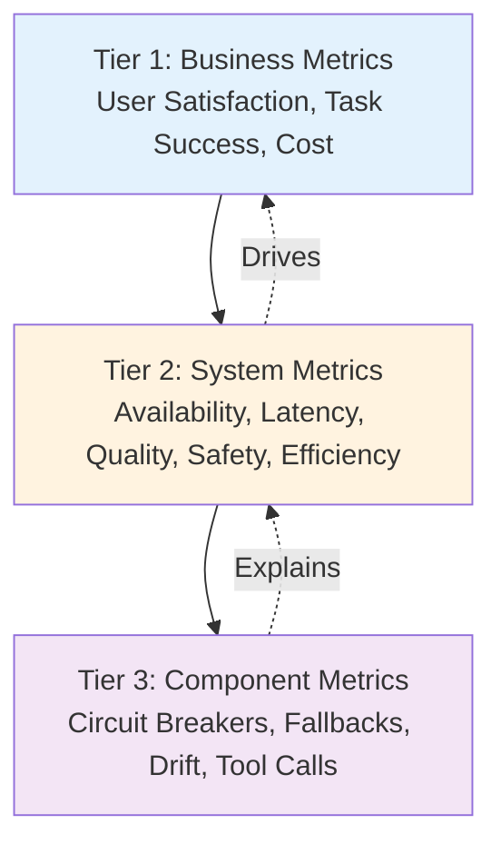

# Metrics Framework: Three-Tier Structure

## Overview

The AIRE Metrics Framework organizes reliability metrics into three tiers, each serving a different audience and purpose:

- **Tier 1: Business Metrics** - What users and executives care about (user satisfaction, task success, cost)
- **Tier 2: System Metrics** - Performance indicators for targets that engineering teams track (cognitive accuracy, safety integrity, autonomy level, response performance, cost efficiency)
- **Tier 3: Component Metrics** - Debugging and optimization metrics for individual components (circuit breakers, fallbacks, drift)

**Principle:** Each tier informs the next. Component metrics explain system metrics. System metrics drive business outcomes.

---

## Tier 1: Business Metrics

**Audience:** Executives, Product Managers, Business Stakeholders

**Purpose:** Measure user value and business impact. These metrics answer: "Are users happy? Is the system delivering value?"

### User Satisfaction

**What It Measures:** User perception of agent quality and usefulness.

**Metrics:**

| Metric | Definition | Target | Measurement |
|--------|------------|--------|-------------|
| **NPS (Net Promoter Score)** | Likelihood to recommend (0-10 scale) | >50 | Survey: "How likely are you to recommend this agent?" |
| **CSAT (Customer Satisfaction)** | Satisfaction rating (1-5 scale) | >4.0 | Survey: "How satisfied are you with this interaction?" |
| **Thumbs Up/Down Rate** | % positive vs negative feedback | >80% positive | In-app feedback buttons |
| **User Retention** | % users who return within 30 days | >60% | Track user return rate |

**Why It Matters:** High user satisfaction correlates with adoption, retention, and business value.

---

### Task Success Rate

**What It Measures:** Did the agent successfully complete the user's request?

**Metrics:**

| Metric | Definition | Target | Measurement |
|--------|------------|--------|-------------|
| **Task Completion Rate** | % requests where agent completed intended task | >90% | Manual review or automated validation |
| **Intent Recognition Accuracy** | % requests where agent understood user intent | >95% | Compare agent intent vs user-reported intent |
| **Resolution Rate** | % queries resolved without escalation | >85% | Track escalations to human support |

**Why It Matters:** Task success directly impacts user value. Low success rates indicate reliability issues.

**Developing themes:**

- **Subjective Success:** What counts as "successful"? 
- **Delayed Feedback:** Success may not be immediately apparent 
- **Multi-Step Tasks:** Success requires multiple steps, how to implement success metrics?
---

### Cost as a First-Class Reliability Metric

**What It Measures:** Cost per successful interaction. Reliability includes cost efficiency.

**Metrics:**

| Metric | Definition | Target | Measurement |
|--------|------------|--------|-------------|
| **Cost per Successful Interaction** | Total cost / Successful interactions | <$0.10 | Track LLM API costs + infrastructure costs |
| **Cost per Request** | Total cost / Total requests | <$0.15 | Average cost across all requests |
| **Cost Efficiency Trend** | Month-over-month cost change | <5% increase | Track cost trends as volume scales |

**Why It Matters:** High costs limit scalability and business viability. Cost optimization is a reliability concern.

**Cost Optimization Strategies:**

- Model routing , using cheaper models for simple queries
- Caching to reduce redundant LLM calls
- Batch processing by grouping similar queries
- Fallback strategies to use expensive models only when needed

---

### Business Metric Targets

**Summary Table:**

| Metric Category | Key Metrics | Target | Frequency |
|-----------------|-------------|--------|-----------|
| **User Satisfaction** | NPS, CSAT, Thumbs Up Rate | NPS >50, CSAT >4.0, >80% positive | Weekly |
| **Task Success** | Task Completion Rate, Intent Recognition | >90% completion, >95% intent | Daily |
| **Cost Efficiency** | Cost per Successful Interaction | <$0.10 per success | Daily |

**Alert Thresholds:**

- **Critical:** User satisfaction drops >10%, task success <85%, cost >$0.15/request
- **Warning:** User satisfaction drops >5%, task success <90%, cost >$0.12/request

---

## Tier 2: System Metrics 

**Audience:** Engineering Teams, SRE, AI Reliability Engineers

**Purpose:** Define performance indicators that map to performance targets. These metrics track system reliability across five dimensions: cognitive accuracy, safety integrity, autonomy level, response performance, and cost efficiency.

### Availability

**What It Measures:** System uptime and error rate.

**Performance Indicators:**

| Indicator | Definition | Target | Measurement |
|-----------|------------|--------|-------------|
| **Uptime** | % time system is available | 99.5% (monthly) | Successful responses / Total requests |
| **Error Rate** | % requests that fail | <0.5% | Failed requests / Total requests |
| **Successful Response Rate** | % requests returning valid responses | >99.5% | Valid responses / Total requests |

**Error Types:**

- **Service Errors:** 5xx HTTP errors, timeouts, rate limits
- **Model Errors:** LLM API failures, model unavailable
- **Infrastructure Errors:** Database failures, queue failures

---

### Latency

**What It Measures:** Response time from user query to agent response.

**Performance Indicators:**

| Indicator | Definition | Target | Measurement |
|-----------|------------|--------|-------------|
| **P50 Latency** | Median response time | <2 seconds | 50th percentile response time |
| **P95 Latency** | 95th percentile response time | <5 seconds | 95th percentile response time |
| **P99 Latency** | 99th percentile response time | <10 seconds | 99th percentile response time |

**Latency Components:**

- **LLM Generation Time:** Time for model to generate response (largest component)
- **Tool Call Time:** Time for external API calls 
- **Guardrail Processing:** Time for input/output validation 
- **Network Latency:** Time for request/response transmission 

---

### Quality

**What It Measures:** Accuracy, groundedness, and correctness of agent outputs.

**Performance Indicators:**

| Indicator | Definition | Target | Measurement |
|-----------|------------|--------|-------------|
| **Hallucination Rate** | % outputs with factual errors | <0.1% | Automated validation |
| **Groundedness** | % outputs supported by sources | >95% | Verify outputs against source documents |
| **Factual Accuracy** | % outputs verified as correct | >95% |Automated checks |

**Unanswered questions:**

- **Sampling:** Cannot evaluate 100% of outputs, due to high cost

---

### Safety

**What It Measures:** Effectiveness of guardrails and security controls.

**Performance Indicators:**

| Indicator | Definition | Target | Measurement |
|-----------|------------|--------|-------------|
| **Guardrail Block Rate** | % malicious inputs blocked | >99.9% | Blocked attempts / Total malicious attempts |
| **Jailbreak Success Rate** | % successful jailbreak attempts | <0.1% | Successful jailbreaks / Total attempts |
| **PII Leakage Rate** | % outputs containing leaked PII | 0% | Detected PII leaks / Total outputs |
| **Unauthorized Action Rate** | % actions exceeding permissions | 0% | Unauthorized actions / Total actions |

**Why It Matters:** Safety failures can cause security incidents, data breaches, and regulatory violations.

---

### Efficiency

**What It Measures:** Human-in-the-Loop (HITL) rate and cost efficiency.

**Performance Indicators:**

| Indicator | Definition | Target | Measurement |
|-----------|------------|--------|-------------|
| **HITL Rate** | % queries requiring human escalation | <10% | Human escalations / Total queries |
| **Cost per Request** | Average cost per request | <$0.15 | Total cost / Total requests |
| **Autonomy Level** | Current maturity level (L0-L4) | L3+ | Track progression through autonomy levels |

**Why It Matters:** High HITL rates limit scalability. Cost efficiency enables business viability.

**HITL Escalation Reasons:**

- Low confidence (<0.7)
- High-risk actions (write operations, high cost)
- Guardrail violations
- User requests human review

---

### System Metric Targets

**Summary Table:**

| Dimension | Key Indicators | Target | Frequency |
|-----------|----------------|--------|-----------|
| **Cognitive Accuracy** | Hallucination Rate, Groundedness, Factual Accuracy | <0.1% hallucinations, >95% grounded | Daily (sampled) |
| **Safety Integrity** | Guardrail Block Rate, Jailbreak Rate | >99.9% blocks, <0.1% jailbreaks | Real-time |
| **Autonomy Level** | HITL Rate, Autonomy Level | <10% HITL, L3+ | Daily |
| **Response Performance** | Uptime, Latency (P50, P95, P99) | 99.5% uptime, P95 <5s | Real-time |
| **Cost Efficiency** | Cost per Request, Cost per Success | <$0.15/request, <$0.10/success | Daily |

**Quality Budget Consumption:**

- **Green Zone (>75% budget):** Normal operations, experimentation encouraged
- **Yellow Zone (50-75% budget):** Reduce deployment velocity, limit risky experiments
- **Red Zone (<50% budget):** Freeze new features, emergency accuracy work

---

## Tier 3: Component Metrics

**Audience:** Engineers debugging issues, optimizing performance

**Purpose:** Granular metrics for individual components. These metrics explain why system metrics degrade and guide optimization efforts.

### Circuit Breaker Metrics

**What It Measures:** Circuit breaker activations and effectiveness.

**Metrics:**

| Metric | Definition | Target | Measurement |
|--------|------------|--------|-------------|
| **Circuit Breaker Activations** | Number of times circuit opened | <10/day | Count circuit opens per day |
| **Circuit Breaker Duration** | Average time circuit stays open | <30 seconds | Time from open to half-open |
| **Failed Request Rate** | % requests failing before circuit opens | <5% | Failed requests / Total requests |

**Why It Matters:** Frequent circuit breaker activations indicate service degradation or cascading failures.

---

### Fallback Usage Metrics

**What It Measures:** Fallback path usage and effectiveness.

**Metrics:**

| Metric | Definition | Target | Measurement |
|--------|------------|--------|-------------|
| **Fallback Usage Rate** | % requests using fallback paths | <15% | Fallback requests / Total requests |
| **Fallback Success Rate** | % fallback requests that succeed | >90% | Successful fallbacks / Total fallbacks |
| **Fallback Latency** | Average latency for fallback paths | <10 seconds | P95 latency for fallback requests |

**Fallback Paths:**

- **Primary → Secondary Model:** GPT-4 → GPT-3.5
- **Model → Rules:** LLM → Rule-based system
- **Autonomous → Human:** Agent → Human escalation

---

### State Management Metrics

**What It Measures:** Checkpoint persistence and recovery effectiveness.

**Metrics:**

| Metric | Definition | Target | Measurement |
|--------|------------|--------|-------------|
| **Checkpoint Persistence Latency** | Time to save checkpoint | <100ms | P95 checkpoint save time |
| **Resumability Rate** | % workflows that resume after failure | >99% | Resumed workflows / Failed workflows |
| **Recovery Time** | Time to recover from checkpoint | <5 seconds | Time from failure to resume |

**Why It Matters:** Fast checkpoint persistence enables quick recovery. High resumability reduces user impact.

---

### Drift Detection Metrics

**What It Measures:** Model and data drift indicators.

**Metrics:**

| Metric | Definition | Target | Measurement |
|--------|------------|--------|-------------|
| **Input Drift Score** | Distribution shift in user queries | <0.1 | Statistical distance (KL divergence) |
| **Output Drift Score** | Distribution shift in agent outputs | <0.1 | Statistical distance (KL divergence) |
| **Model Drift Score** | Performance degradation on golden dataset | <5% | Accuracy drop on golden dataset |
| **Confidence Drift** | Shift in confidence score distribution | <0.1 | Statistical distance (mean shift) |

**Why It Matters:** Drift indicates model degradation or changing user behavior. Early detection enables proactive retraining.

---

### Tool Call Metrics

**What It Measures:** External tool integration reliability.

**Metrics:**

| Metric | Definition | Target | Measurement |
|--------|------------|--------|-------------|
| **Tool Call Success Rate** | % successful tool calls | >95% | Successful calls / Total calls |
| **Tool Call Latency** | Average latency for tool calls | <2 seconds | P95 tool call latency |
| **Tool Call Error Rate** | % tool calls that fail | <5% | Failed calls / Total calls |

**Why It Matters:** Tool failures degrade user experience and task success rates.

---

### Component Metric Targets

**Summary Table:**

| Component | Key Metrics | Target | Frequency |
|-----------|-------------|--------|-----------|
| **Circuit Breakers** | Activations, Duration | <10/day, <30s | Real-time |
| **Fallbacks** | Usage Rate, Success Rate | <15%, >90% | Daily |
| **State Management** | Persistence Latency, Resumability | <100ms, >99% | Real-time |
| **Drift Detection** | Input/Output/Model Drift | <0.1, <5% | Daily |
| **Tool Calls** | Success Rate, Latency | >95%, <2s | Real-time |

---

## Metric Relationships

**How Tiers Connect:**

**Example Flow:**

1. **Business Metric Degrades:** User satisfaction drops 10%
2. **System Metric Investigation:** Task success rate drops to 85% (from 90%)
3. **Component Metric Root Cause:** Tool call success rate drops to 90% (from 95%)
4. **Fix:** Update external API integration, improve error handling
5. **Verification:** Tool call success rate recovers to 96%, task success recovers to 91%, user satisfaction recovers

---

## Further Reading

- [Operational Excellence →](../pillars/operational-excellence.md) (Performance targets, quality budgets)
- [Resilient Architecture →](../pillars/resilient-architecture.md) (Component reliability patterns)

