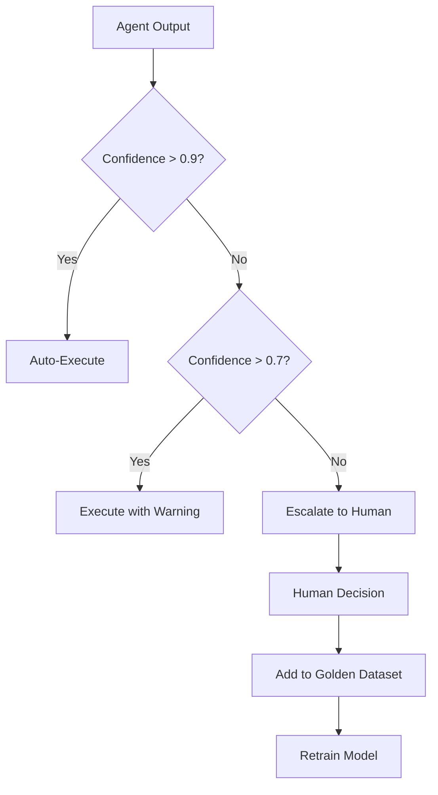

# Pillar 2: Cognitive Reliability

## Philosophy

> *"Measure, Don't Assume"* — If you cannot quantify reliability, you do not have a reliable system. Intuition is not evidence.

Cognitive reliability addresses the correctness problem: ensuring outputs are accurate, grounded, and trustworthy. Unlike traditional software bugs (deterministic and reproducible), AI failures are probabilistic—hallucinations, drift, and inconsistency emerge unpredictably.

**The goal:** Validate outputs, detect drift, and continuously improve through measurement.

---

## Core Concepts

### 1. Self-Reflection & Correction

**Principle:** Make agents critique their own outputs before finalizing decisions.

For high-stakes decisions, single-pass reasoning is insufficient. Self-reflection adds a validation layer where the agent reviews its own work.

**Two Approaches:**

**Chain-of-Thought with Reflection:**
1. Agent generates initial answer with reasoning
2. Agent critiques its own reasoning (identify flaws, biases, missing context)
3. Agent revises answer based on critique
4. Return final answer

**Multi-Agent Debate:**
1. Multiple agents independently generate answers
2. Agents debate their solutions (argue for/against each approach)
3. Consensus mechanism selects final answer (majority vote, confidence-weighted, or meta-agent arbitration)

**When to Use:**
- High-stakes decisions (medical diagnosis, legal advice, financial transactions)
- Complex reasoning tasks (multi-step math, code generation, strategic planning)
- Low-confidence outputs (agent uncertainty score <0.7)

**Trade-offs:**
- **Cost:** 2-5x more LLM calls
- **Latency:** 2-3x slower response time
- **Accuracy:** 15-40% reduction in error rate (domain-dependent)

**Implementation Pattern:**

```pseudocode
function selfReflect(userQuery):
    # Step 1: Generate initial answer
    initialAnswer = llm.generate(userQuery)

    # Step 2: Self-critique
    critique = llm.generate(
        "Review this answer for errors, biases, and gaps: " + initialAnswer
    )

    # Step 3: Revise based on critique
    finalAnswer = llm.generate(
        "Original: " + initialAnswer +
        "\nCritique: " + critique +
        "\nProvide revised answer:"
    )

    return finalAnswer
```

---

### 2. Structured Outputs

**Principle:** Force outputs into predictable formats for deterministic validation.

LLMs produce unstructured text. Structured outputs (JSON, enums, regex-constrained) enable programmatic validation and downstream integration.

**Three Techniques:**

| Technique | Use Case | Example |
|-----------|----------|---------|
| **JSON Schema** | Complex nested data | `{"sentiment": "positive", "confidence": 0.92, "entities": [...]}` |
| **Forced Choice (Enums)** | Classification tasks | `status: ["approved", "rejected", "needs_review"]` |
| **Regex Constraints** | Formatted strings | Email, phone numbers, dates |

**Benefits:**

- **Validation:** Reject malformed outputs before they reach production
- **Type Safety:** Integrate with strongly-typed codebases
- **Consistency:** Eliminate format variations ("yes" vs "Yes" vs "true")

**Implementation Pattern:**

```pseudocode
schema = {
    "type": "object",
    "properties": {
        "action": {"enum": ["approve", "reject", "escalate"]},
        "confidence": {"type": "number", "minimum": 0, "maximum": 1},
        "reasoning": {"type": "string"}
    },
    "required": ["action", "confidence"]
}

function processWithSchema(userQuery):
    rawOutput = llm.generate(userQuery)

    try:
        structuredOutput = validateSchema(rawOutput, schema)
        return structuredOutput
    catch ValidationError:
        # Retry with schema in prompt
        retryOutput = llm.generate(
            userQuery + "\nRespond in JSON format: " + schema
        )
        return validateSchema(retryOutput, schema)
```

---

### 3. Human-in-the-Loop (HITL) Protocols

**Principle:** Use humans as a safety net for edge cases—not a crutch for poor engineering.

HITL adds human review for high-stakes or low-confidence decisions. The goal is to **reduce HITL over time** through active learning.

**Confidence-Based Escalation:**



**Design Patterns to Reduce HITL:**

| Pattern | Description | Example |
|---------|-------------|---------|
| **Active Learning** | Add human corrections to training data | HITL corrections → golden dataset → model retraining |
| **Staged Rollout** | Start with 100% HITL, reduce over time | Month 1: 100% review → Month 3: 10% review |
| **Confidence Calibration** | Improve agent's self-awareness | Train model to predict its own accuracy |
| **Batch Review** | Group similar low-confidence cases | Human reviews 50 refund requests at once |

**Metrics:**

- **HITL Rate:** % requests requiring human review (target: <10%)
- **HITL Response Time:** Median time from escalation to human decision (target: <5 minutes)
- **Override Rate:** % times humans overrule agent (target: <20%)

**Anti-Pattern:** Using HITL for all decisions because "we don't trust the AI." This defeats the purpose of automation.

---

### 4. Drift Detection

**Principle:** Monitor for distribution shifts in inputs, outputs, and model behavior.

AI systems degrade over time as real-world data drifts from training data. Proactive drift detection prevents silent failures.

**Three Types of Drift:**

| Drift Type | What Changes | Example | Detection Method |
|------------|--------------|---------|------------------|
| **Input Drift** | User query distribution | COVID pandemic shifts customer support queries | Embedding divergence, statistical tests |
| **Output Drift** | Agent response patterns | Model starts refusing more queries | Sentiment shift, keyword frequency |
| **Model Drift** | Underlying model behavior | GPT-4 version update changes reasoning style | A/B test old vs new model |

**Embedding Divergence Tracking:**

Compare embedding distributions between baseline (training data) and production (live queries):

```pseudocode
function detectInputDrift():
    # Baseline embeddings from golden dataset
    baselineEmbeddings = embed(goldenDataset.inputs)

    # Production embeddings from last 24 hours
    productionEmbeddings = embed(recentQueries)

    # Calculate divergence (KL divergence, cosine distance)
    divergence = calculateDivergence(baselineEmbeddings, productionEmbeddings)

    if divergence > DRIFT_THRESHOLD:
        alert("Input drift detected: " + divergence)
        triggerDatasetRefresh()
```

**Mitigation Strategies:**

- **Dataset refresh:** Add recent production examples to golden dataset
- **Model retraining:** Fine-tune on recent data
- **Prompt updates:** Adjust prompts for new query patterns
- **Fallback triggers:** Route drifted queries to more powerful models

---

## Metrics & Observability

Track these metrics to measure cognitive reliability:

| Metric | Target | Measurement |
|--------|--------|-------------|
| **Hallucination Rate** | <0.1% | % outputs containing factually incorrect claims |
| **Groundedness** | >95% | % claims supported by retrieved context or known facts |
| **Consistency Rate** | >90% | % identical inputs producing semantically equivalent outputs |
| **HITL Rate** | <10% | % requests requiring human review |
| **Confidence Calibration** | Within 10% | Difference between predicted confidence and actual accuracy |
| **Drift Alert Frequency** | <1/week | Count of drift alerts triggering dataset refresh |

**Measurement Techniques:**

- **Hallucination Rate:** Use fact-checking models (e.g., retrieval-augmented verification)
- **Groundedness:** Compare output claims against source documents (citation matching)
- **Consistency:** Generate embeddings for outputs to same input; measure cosine similarity
- **Confidence Calibration:** Plot predicted confidence vs. actual accuracy; measure calibration error

---

## Common Pitfalls

1. **No Structured Outputs**
      - *Problem:* LLM returns freeform text that breaks downstream systems
      - *Fix:* Enforce JSON schemas or enums for all production outputs

2. **Over-Reliance on Self-Reflection**
      - *Problem:* Using reflection for all queries wastes cost/latency
      - *Fix:* Reserve reflection for high-stakes decisions only

3. **Static Golden Datasets**
      - *Problem:* Dataset becomes stale as real-world queries drift
      - *Fix:* Continuously update golden dataset from production failures

4. **HITL as Crutch**
      - *Problem:* 50%+ of queries need human review indefinitely
      - *Fix:* Implement active learning to reduce HITL over time

5. **No Confidence Calibration**
      - *Problem:* Agent claims 90% confidence but is only 50% accurate
      - *Fix:* Train model on confidence prediction; validate against ground truth

6. **Ignoring Drift**
      - *Problem:* Performance silently degrades as data distribution shifts
      - *Fix:* Set up automated drift monitoring with alerts

---

*This pillar is part of the [AI Reliability Engineering (AIRE) Standards](../index.md). Licensed under [CC BY 4.0](https://creativecommons.org/licenses/by/4.0/).*
