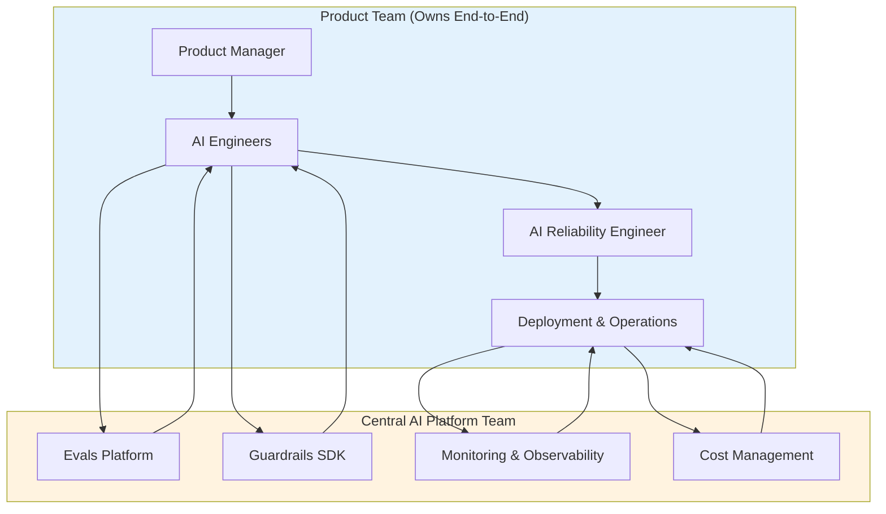
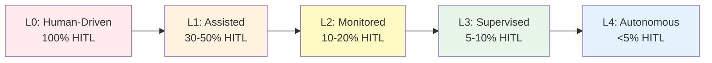

# Pillar 5: Operational Excellence & Team Culture

## Philosophy

> *"Reliability is a Feature"* - Reliability competes with velocity for engineering resources. Treat it as a first-class product requirement with explicit budgets, not an afterthought.

Operational Excellence bridges the gap between technical architecture and organizational culture. While the first four pillars define *what* to build, this pillar defines *how* teams operate, measure, and continuously improve AI systems at scale.

**The goal:** Establish performance targets, quality budgets, team structures, and operational practices that enable reliable AI systems to scale across organizations.

---

## Core Concepts

### 1. AI-Specific Performance Targets and Quality Budgets

**Principle:** Define performance targets that matter for AI systems-not just uptime, but cognitive accuracy, safety, and autonomy.

Traditional SRE focuses on binary success/failure (uptime, error rate). AI systems operate in a probabilistic space where "success" is nuanced: outputs can be partially correct, hallucinations can be subtle, and quality degrades gradually. **Quality Budgets** (not error budgets) track acceptable degradation in accuracy, groundedness, and safety-enabling teams to balance innovation velocity with reliability.

**Key Difference:** Traditional error budgets track "how many failures can we tolerate?" AI quality budgets track "how much accuracy degradation can we accept while shipping improvements?"

**AI Performance Dimensions:**

| Dimension | Performance Indicators | Example Measurement |
|-----------|----------------------|---------------------|
| **Cognitive Accuracy** | Hallucination rate, factual correctness, groundedness | % outputs verified as factually correct (sampled) |
| **Safety Integrity** | Guardrail effectiveness, jailbreak resistance | % malicious inputs successfully blocked |
| **Autonomy Level** | HITL rate, confidence calibration | % queries resolved without human escalation |
| **Response Performance** | Latency (P50, P95, P99), availability | Time from user query to agent response |
| **Cost Efficiency** | Cost per successful interaction | Total cost / Successful interactions |

**Example Performance Target Definitions:**

```yaml
Service: Customer Support Agent
Performance Targets:
  Cognitive Accuracy:
    Indicator: Factually correct outputs / Total outputs (sampled)
    Target: 95% accuracy (monthly)
    Quality Budget: 5% degradation acceptable (allows experimentation)
  
  Safety Integrity:
    Indicator: Successful guardrail blocks / Total malicious attempts
    Target: 99.9% block rate
    Quality Budget: 0.1% jailbreak success rate (zero tolerance for safety)
  
  Autonomy Level:
    Indicator: Queries resolved autonomously / Total queries
    Target: 90% autonomous (HITL rate <10%)
    Quality Budget: 10% can require human escalation (progressive improvement)
  
  Response Performance:
    Indicator: P95 response time
    Target: <5 seconds
    Quality Budget: 5% of requests can exceed 5 seconds
  
  Cost Efficiency:
    Indicator: Cost per successful interaction
    Target: <$0.10 per success
    Quality Budget: 10% cost variance acceptable
```

**Quality Budget Policy:**

Quality budgets track acceptable degradation in performance dimensions, enabling teams to experiment while maintaining reliability:

- **Green Zone (>75% budget remaining):** Normal operations, feature development continues, experimentation encouraged
- **Yellow Zone (50-75% budget remaining):** Reduce deployment velocity, focus on accuracy improvements, limit risky experiments
- **Red Zone (<50% budget remaining):** Freeze new features, emergency accuracy work only, rollback if necessary

**Quality Budget Consumption:**

AI systems degrade gradually, not in binary failures. Quality budgets track acceptable accuracy degradation:

- **Cognitive Accuracy Degradation:** Hallucination rate increases, factual correctness drops, groundedness decreases
- **Safety Degradation:** Guardrail effectiveness drops, jailbreak success rate increases
- **Autonomy Regression:** HITL rate increases, confidence calibration worsens
- **Performance Degradation:** Latency increases, availability drops, cost per request increases

**Tracking Quality Budget:**

```pseudocode
function consumeQualityBudget(dimension, degradation):
    budget = getCurrentQualityBudget(dimension)
    
    # Different dimensions have different weights
    if dimension == "cognitive_accuracy":
        consumed = degradation * 1.0  # Full weight (core reliability)
    elif dimension == "safety":
        consumed = degradation * 20.0  # 20x weight (zero tolerance)
    elif dimension == "autonomy":
        consumed = degradation * 0.5  # Half weight (progressive improvement)
    elif dimension == "performance":
        consumed = degradation * 0.3  # Low weight (operational concern)
    
    budget.remaining -= consumed
    
    if budget.remaining < 0.5:
        triggerRedZoneProtocol(dimension)
```

---

### 2. Team Structure and Shared Responsibility

**Principle:** Product teams own their AI agents end-to-end (dev, deploy, operate). Central platform teams provide infrastructure and tooling.

Traditional DevOps separates development from operations. AI Reliability Engineering requires **embedded ownership**-teams that build agents must also operate them. This creates accountability and faster feedback loops.

**Shared Responsibility Model:**



**Team Structure:**

**1. Product Teams (Owners):**
- **AI Engineers:** Build and maintain agents, prompts, tool integrations
- **AI Reliability Engineers (AIREs):** Embedded reliability specialists (20% time allocation)
- **Product Managers:** Define performance targets, prioritize reliability work
- **Responsibilities:**
  - End-to-end ownership of agent reliability
  - Golden dataset curation and updates
  - Production incident response
  - Performance target compliance and quality budget management

**2. Central AI Platform Team (Infrastructure):**
- **Platform Engineers:** Build and maintain shared infrastructure
- **Responsibilities:**
  - Evals platform (CI/CD integration, golden dataset execution)
  - Guardrails SDK (standardized security controls)
  - Monitoring and observability (dashboards, alerts, performance indicator tracking)
  - Cost optimization tooling (model routing, caching, rate limiting)

**Embedded Reliability Engineers:**

AI Reliability Engineers (AIREs) are embedded in product teams, not centralized. This ensures reliability work is prioritized alongside feature development.

**20% Time Allocation Model:**

- **10% Golden Dataset Maintenance:** Weekly updates from production failures, HITL escalations
- **5% Eval Pipeline Improvements:** Reduce eval runtime, improve coverage, add new test cases
- **5% Incident Response:** Postmortems, root cause analysis, reliability improvements

**Reliability Review Meetings:**

**Weekly Metric Reviews:**
- Review performance indicator trends (cognitive accuracy, safety integrity, autonomy level, response performance, cost efficiency)
- Quality budget consumption status
- Identify degradation trends before performance target violations
- Action items for reliability improvements

**Monthly Postmortem Reviews:**
- Deep dive into production incidents
- Update golden datasets with failure cases
- Refine performance targets based on learnings
- Share patterns across teams

**Example Meeting Structure:**

```markdown
Weekly Reliability Review (30 minutes):
1. Performance Indicator Review (5 min)
   - Cognitive Accuracy: 94.2% (target: 95%) ⚠️
   - Safety Integrity: 99.95% (target: 99.9%) ✓
   - Autonomy Level: 88% autonomous (target: 90%) ⚠️
   - Response Performance: P95 4.2s (target: <5s) ✓
   - Cost Efficiency: $0.11/success (target: <$0.10) ⚠️

2. Quality Budget Status (5 min)
   - Remaining: 65% (Yellow Zone)
   - Cognitive accuracy degradation consuming budget faster than expected

3. Action Items (20 min)
   - [AIRE] Add 20 new quality test cases to golden dataset
   - [AI Engineer] Investigate accuracy drop in recent deployment
   - [PM] Review HITL escalation patterns for autonomy improvements
```

---

### 3. AI Ops Mindset & Progressive Autonomy

**Vision:** AI systems should progressively become more autonomous, requiring less human intervention over time.

Human-in-the-Loop (HITL) is a safety net, not a permanent crutch. The goal is to reduce HITL rate over time through active learning, improved guardrails, and better confidence calibration.

**Progressive Autonomy Maturity Model:**

Five levels of agent autonomy, from fully human-driven to fully autonomous:

| Level | Name | Human Role | Example | HITL Rate |
|-------|------|------------|---------|-----------|
| **L0** | Human-Driven | Human makes all decisions | Agent suggests actions, human approves each | 100% |
| **L1** | Assisted | Human approves high-risk actions | Agent executes low-risk, escalates high-risk | 30-50% |
| **L2** | Monitored | Human reviews periodically | Agent executes, human audits samples | 10-20% |
| **L3** | Supervised | Human intervenes on anomalies | Agent executes, human alerted on drift/anomalies | 5-10% |
| **L4** | Autonomous | Human defines policies only | Agent executes fully autonomously within guardrails | <5% |

**Maturity Progression:**



**Level 0: Human-Driven (100% HITL)**

**Characteristics:**
- Agent generates suggestions, human approves every action
- No autonomous execution
- High safety, low efficiency

**Use Cases:**
- High-stakes domains (medical diagnosis, legal advice)
- Early-stage agents (first 30 days in production)
- Regulatory compliance requirements

**Example:**
```pseudocode
function processRequest(userRequest):
    suggestion = agent.generateAction(userRequest)
    humanApproval = await humanReview(suggestion)
    
    if humanApproval.approved:
        return executeAction(suggestion)
    else:
        return humanApproval.feedback
```

**Level 1: Assisted (30-50% HITL)**

**Characteristics:**
- Agent executes low-risk actions autonomously
- Human approval required for high-risk actions
- Risk classification based on action type, confidence score, resource impact

**Risk Classification:**
- **Low-Risk:** Read-only operations, low-cost actions, high-confidence outputs
- **High-Risk:** Write operations, high-cost actions, low-confidence outputs, sensitive data access

**Example:**
```pseudocode
function processRequest(userRequest):
    action = agent.generateAction(userRequest)
    riskLevel = classifyRisk(action, agent.confidence)
    
    if riskLevel == "low":
        return executeAction(action)  # Autonomous
    else:
        humanApproval = await humanReview(action)
        return executeAction(action) if humanApproval.approved else reject()
```

**Level 2: Monitored (10-20% HITL)**

**Characteristics:**
- Agent executes autonomously
- Human reviews random samples (10-20% of requests)
- Post-execution audit, not pre-execution approval

**Sampling Strategy:**
- Random sampling: 10% of all requests
- Stratified sampling: Higher rate for high-risk actions
- Anomaly sampling: 100% review for drift alerts, low confidence

**Example:**
```pseudocode
function processRequest(userRequest):
    action = agent.generateAction(userRequest)
    result = executeAction(action)
    
    # Post-execution sampling
    if shouldSample(userRequest, result):
        humanReview = await humanAudit(userRequest, action, result)
        if humanReview.flagged:
            triggerCorrection(result, humanReview.feedback)
    
    return result
```

**Level 3: Supervised (5-10% HITL)**

**Characteristics:**
- Agent executes fully autonomously
- Human intervention only on anomalies (drift, low confidence, guardrail triggers)
- Proactive monitoring, reactive human involvement

**Anomaly Detection:**
- Input drift: Distribution shift in user queries
- Output drift: Confidence score degradation
- Model drift: Performance degradation on golden dataset
- Guardrail triggers: Safety violations, rate limit breaches

**Example:**
```pseudocode
function processRequest(userRequest):
    # Anomaly detection
    if detectDrift(userRequest) or detectLowConfidence() or guardrailTriggered():
        humanIntervention = await humanReview(userRequest)
        return processWithHumanGuidance(userRequest, humanIntervention)
    
    # Normal autonomous execution
    action = agent.generateAction(userRequest)
    return executeAction(action)
```

**Level 4: Autonomous (<5% HITL)**

**Characteristics:**
- Agent executes fully autonomously within guardrails
- Human defines policies, not individual decisions
- HITL only for policy exceptions and edge cases

**Policy-Based Control:**
- Guardrails enforce deterministic constraints
- Confidence thresholds define autonomous boundaries
- Cost limits prevent runaway spending
- Audit logs enable retrospective review

**Example:**
```pseudocode
function processRequest(userRequest):
    # Policy checks (deterministic)
    if violatesGuardrails(userRequest):
        return rejectWithReason("Guardrail violation")
    
    if exceedsCostLimit(userRequest):
        return escalateToHuman("Cost limit exceeded")
    
    # Autonomous execution
    action = agent.generateAction(userRequest)
    return executeAction(action)
```

**Progression Strategy:**

**Phase 1: Start at L0 (Human-Driven)**
- Build trust through human oversight
- Collect failure patterns for golden dataset
- Establish baseline metrics

**Phase 2: Move to L1 (Assisted)**
- Classify actions by risk level
- Enable autonomous execution for low-risk actions
- Monitor HITL rate and error rates

**Phase 3: Advance to L2 (Monitored)**
- Implement sampling-based review
- Reduce HITL rate to 10-20%
- Focus on high-risk action classification

**Phase 4: Reach L3 (Supervised)**
- Deploy anomaly detection
- Reduce HITL to 5-10%
- Improve confidence calibration

**Phase 5: Achieve L4 (Autonomous)**
- Policy-based control replaces case-by-case review
- HITL rate <5%
- Continuous improvement through feedback loops

**Key Metrics for Progression:**

| Metric | L0→L1 | L1→L2 | L2→L3 | L3→L4 |
|--------|-------|-------|-------|-------|
| **HITL Rate** | 100% → 40% | 40% → 15% | 15% → 7% | 7% → 3% |
| **Error Rate** | Baseline | <2% increase | <1% increase | <0.5% increase |
| **Confidence Calibration** | N/A | ±15% | ±10% | ±5% |
| **Time in Level** | 30 days | 60 days | 90 days | Continuous |

---

## Metrics & Observability

Track these metrics to measure operational excellence:

| Metric | Target | Measurement |
|--------|--------|-------------|
| **Performance Target Compliance** | >95% | % of performance targets met per month |
| **Quality Budget Remaining** | >50% | % of quality budget remaining at month end |
| **HITL Rate** | <10% | % queries requiring human escalation |
| **Autonomy Level** | L3+ | Current maturity level (L0-L4) |
| **Reliability Review Attendance** | >90% | % team members attending weekly reviews |
| **Golden Dataset Update Frequency** | Weekly | Days between dataset updates |
| **Postmortem Completion Rate** | 100% | % incidents with completed postmortems |
| **Time to Autonomy** | <6 months | Time from L0 to L3 |

**Observability Requirements:**

- **Performance Dashboards:** Real-time performance indicator tracking, quality budget consumption
- **HITL Analytics:** Escalation patterns, root causes, reduction trends
- **Autonomy Tracking:** Current level, progression velocity, regression alerts
- **Team Metrics:** Reliability review attendance, postmortem completion, golden dataset health

---

## Common Pitfalls

1. **No Quality Budgets**
      - *Problem:* Treating all reliability work as equally urgent, unable to balance innovation with accuracy
      - *Fix:* Define performance targets and quality budgets for each dimension. Use budgets to prioritize work and enable experimentation.

2. **Centralized Reliability Team**
      - *Problem:* Reliability becomes "someone else's problem," product teams don't own outcomes
      - *Fix:* Embed AIREs in product teams. Central platform team provides infrastructure only.

3. **Static HITL Rate**
      - *Problem:* HITL rate stays at 100% indefinitely, no progression toward autonomy
      - *Fix:* Implement Progressive Autonomy Maturity Model. Set targets for HITL reduction.

4. **Missing Reliability Reviews**
      - *Problem:* No regular cadence for reviewing metrics, incidents go unaddressed
      - *Fix:* Weekly metric reviews, monthly postmortems. Make attendance mandatory.

5. **Performance Targets Without Action**
      - *Problem:* Tracking metrics but not using them to drive decisions
      - *Fix:* Link performance target violations to deployment freezes. Use quality budgets to gate feature velocity and enable controlled experimentation.

---

## Further Reading

- [AIRE Principles →](../principles.md)

