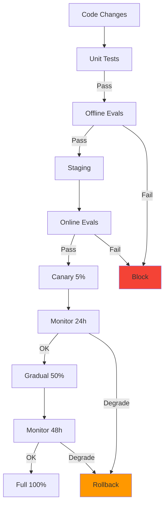
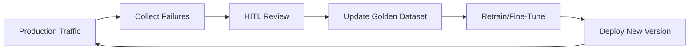

# Pillar 3: Quality & Lifecycle

## Philosophy

> *"Reliability is a Feature"* - Reliability competes with velocity for engineering resources. Treat it as a first-class requirement, not an afterthought.

Quality in AI systems cannot rely on "vibes" or spot checks. Unlike traditional software where correctness is binary, AI correctness is subjective and probabilistic. Quality & Lifecycle practices move development from intuition to rigorous, measurable engineering.

**The goal:** Measurable, reproducible, and improvable systems through automated testing and feedback loops.

---

## Core Concepts

### 1. Evals-Driven Deployments

**Principle:** Never deploy without passing a regression suite. Vibes are not a deployment strategy.

CI/CD gates for AI systems must measure output correctness, not just code correctness.

**Deployment Pipeline:**



**Eval-Driven Deployment Checklist:**

| Stage | Action | Pass Criteria | Rollback Trigger |
|-------|--------|---------------|------------------|
| **Offline Evals** | Run on golden dataset | Accuracy >95% | <95% accuracy |
| **Staging** | Deploy to internal users | No crashes | Critical errors |
| **Canary (5%)** | Monitor P95 latency, error rate | Within 10% of baseline | >10% degradation |
| **Gradual (50%)** | Monitor hallucination rate | <0.1% | >0.15% |
| **Full (100%)** | Monitor user satisfaction | >80% | <75% |

**Rollback Triggers:** Automatic rollback if any metric degrades beyond threshold.

---

### 2. Golden Datasets

**Principle:** Your eval suite is only as good as your test data.

Golden datasets are curated regression suites of inputs with labeled expected outputs. They're the foundation of offline evals.

**Composition:**

- **60% Core Capabilities:** Common queries representing primary use cases
- **30% Edge Cases:** Rare but important scenarios (e.g., ambiguous inputs, multi-step reasoning)
- **10% Adversarial:** Jailbreak attempts, prompt injection, nonsense inputs

**Maintenance Triggers:**

- Production failures (add failed examples weekly)
- HITL escalations (add human-corrected cases)
- Quarterly review (remove stale examples, add new patterns)

**Size Guidelines:**

| System Complexity | Minimum Dataset Size | Recommended |
|-------------------|---------------------|-------------|
| Simple classifier | 50 examples | 100-200 |
| Multi-turn agent | 100 examples | 200-500 |
| Complex workflow | 200 examples | 500-1000 |

**Version Control:** Store in Git with semantic versioning (v1.2.3). Track changes in CHANGELOG.

**Example Structure:**

```pseudocode
goldenDataset = [
    {
        "id": "refund-001",
        "input": "I want to refund order #12345",
        "expected_action": "initiate_refund",
        "expected_confidence": ">0.8",
        "tags": ["refund", "core"],
        "added_date": "2024-01-15"
    },
    # ... more examples
]
```

---

### 3. Unit Testing Agents

**Principle:** Test components in isolation before testing end-to-end workflows.

**Three Types of Unit Tests:**

| Test Type | What It Tests | Example |
|-----------|--------------|---------|
| **Tool Calling** | Agent selects correct tool | Query "What's the weather?" → calls `getWeather()` |
| **Prompt Adherence** | Agent follows instructions | "Respond in JSON" → output is valid JSON |
| **Synthetic Data** | Agent handles edge cases | Empty input, special characters, long text |

**Example: Tool Calling Test**

```pseudocode
function testToolSelection():
    testCases = [
        {"input": "What's the weather?", "expected_tool": "getWeather"},
        {"input": "Send email to john@example.com", "expected_tool": "sendEmail"},
        {"input": "Book a flight to NYC", "expected_tool": "bookFlight"}
    ]

    for testCase in testCases:
        output = agent.process(testCase.input)
        assert output.toolCalled == testCase.expected_tool
```

---

### 4. Online vs Offline Evals

**Principle:** Offline evals catch regressions. Online evals catch unknowns.

| Aspect | Offline Evals | Online Evals |
|--------|---------------|--------------|
| **When** | Pre-deployment (CI/CD) | Post-deployment (production) |
| **Data** | Golden dataset (known examples) | Live traffic (real users) |
| **Cost** | Cheap (run on fixed dataset) | Expensive (run on all traffic) |
| **Purpose** | Catch regressions | Detect drift and unknowns |
| **Feedback Loop** | Immediate (blocks deployment) | Delayed (triggers alerts) |

**Offline Eval Strategy:**

- Run on every pull request
- Block merge if accuracy drops >5%
- Fast feedback (<5 minutes)

**Online Eval Strategy:**

- Sample 10% of production traffic
- Run async (don't block user responses)
- Alert if hallucination rate >0.1%
- Feed failures back to golden dataset

---

### 5. Feedback Loops for Continuous Improvement

**Principle:** Production failures should automatically improve your system.



**Feedback Loop Velocity:**

| Activity | Frequency | Owner |
|----------|-----------|-------|
| **Failure Collection** | Real-time | Automated monitoring |
| **HITL Review** | Daily | Human reviewers |
| **Golden Dataset Updates** | Weekly | ML engineers |
| **Model Retraining** | Monthly | ML engineers |

**Key Metrics:**

- **Feedback Loop Latency:** Time from production failure to golden dataset inclusion (target: <7 days)
- **Dataset Growth Rate:** New examples added per month (target: 10-20%)
- **Improvement Rate:** Accuracy gain per retrain cycle (target: 1-3%)

---

## Metrics & Observability

Track these metrics to measure quality and lifecycle maturity:

| Metric | Target | Measurement |
|--------|--------|-------------|
| **Golden Dataset Accuracy** | >95% | % correct predictions on golden dataset |
| **Deployment Success Rate** | >90% | % deployments that don't rollback |
| **User Satisfaction** | >80% | NPS, thumbs up/down, explicit feedback |
| **Feedback Loop Latency** | <7 days | Time from failure to dataset inclusion |
| **Eval Runtime** | <5 minutes | P95 time for offline evals in CI/CD |
| **Cost per Eval** | <$1 | Average cost to run golden dataset eval |

**Observability Requirements:**

- **Chain of Thought (CoT) Logging:** Capture agent reasoning, not just inputs/outputs
- **Cost Tracking:** Monitor per-workflow and per-tenant costs
- **Eval Dashboards:** Real-time view of offline/online eval results

---

## Common Pitfalls

1. **No Golden Dataset**
      - *Problem:* Deploying changes without regression testing
      - *Fix:* Build golden dataset with 100+ examples before first deployment

2. **Static Golden Dataset**
      - *Problem:* Dataset becomes stale; doesn't reflect production queries
      - *Fix:* Weekly updates from production failures and HITL escalations

3. **Insufficient Coverage**
      - *Problem:* Golden dataset only tests happy paths, not edge cases
      - *Fix:* 60% core, 30% edge, 10% adversarial distribution

4. **Ignoring Online Metrics**
      - *Problem:* Offline evals pass but production performance degrades
      - *Fix:* Set up online eval sampling and drift alerts

5. **Slow Feedback Loops**
      - *Problem:* Months between production failure and model improvement
      - *Fix:* Automate failure collection, weekly dataset updates

6. **No Eval-Driven Gates**
      - *Problem:* Deploying to production without passing evals
      - *Fix:* Block deployments if offline evals fail

---

*This pillar is part of the [AI Reliability Engineering (AIRE) Standards](../index.md). Licensed under [CC BY 4.0](https://creativecommons.org/licenses/by/4.0/).*
