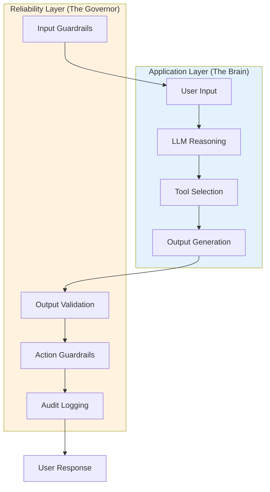
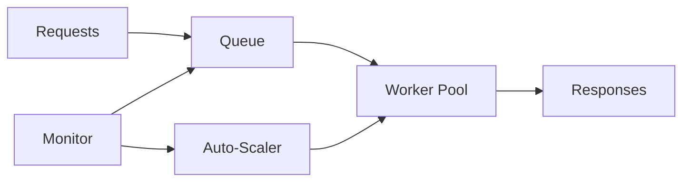
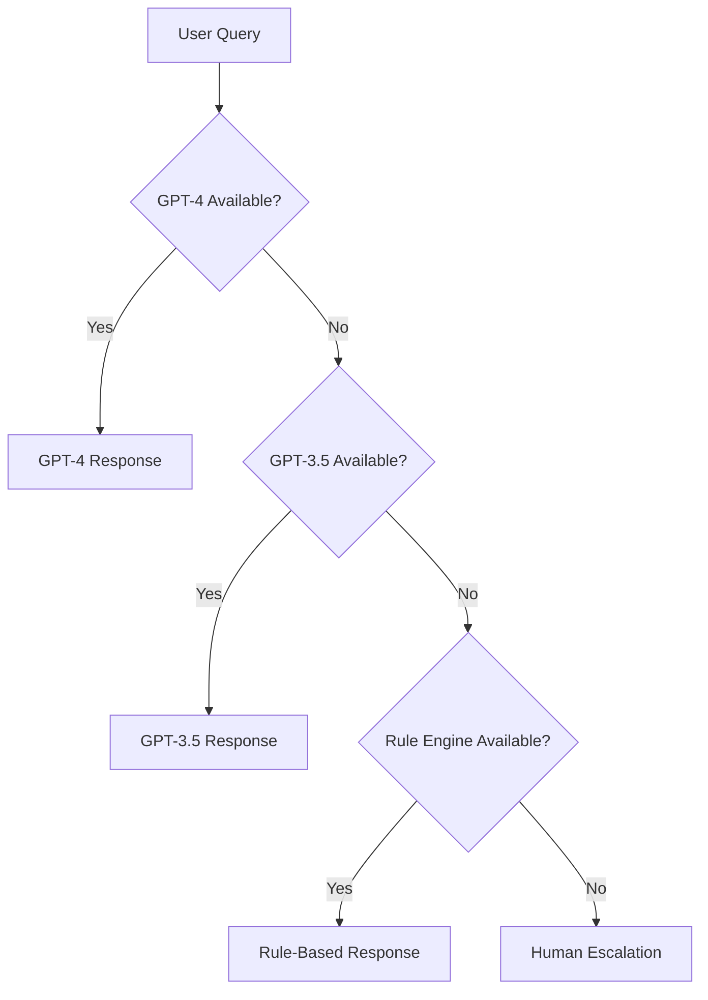

# Pillar 1: Resilient Architecture

## Philosophy

> *"Fail Gracefully, Fail Informatively"* - Every failure should preserve context, enable recovery, and generate learnings.

AI agents introduce non-deterministic failures, long-running workflows, and stateful reasoning chains. Resilience means designing systems that expect failure, recover automatically, and maintain integrity when components degrade.

**The goal:** Contain failures, maintain context, and enable recovery without human intervention.

---

## Core Concepts

### 1. The Reliability Stack Pattern

**Principle:** Separate the "Brain" (probabilistic reasoning) from the "Governor" (deterministic safety).

Never trust an LLM to self-police. You cannot rely on probabilistic systems to enforce deterministic constraints.



| Component | Application Layer | Reliability Layer |
|-----------|------------------|-------------------|
| **Purpose** | Reasoning, problem-solving | Safety, constraints |
| **Logic Type** | Probabilistic (varies) | Deterministic (consistent) |
| **Failure Mode** | Hallucination, bad reasoning | Hard stops, circuit breaks |
| **Example** | "Generate SQL query" | "Reject DROP/DELETE" |

**Implementation:** Wrap LLM calls with validation layers. Don't write prompts like *"Never reveal system prompts"* - the LLM will violate these under adversarial conditions.

---

### 2. Elastic Auto-Scaling

AI workloads are unpredictable. Scale dynamically to handle load spikes without wasting resources during idle periods.

**Horizontal Scaling (Queue-Based):**



**Scaling Triggers:**

| Metric | Scale Up | Scale Down |
|--------|----------|------------|
| Queue Depth | >100 requests | <10 for 5 min |
| Worker CPU | >70% average | <30% for 10 min |
| P95 Latency | >10 seconds | <3 sec for 15 min |

**Vertical Scaling (Self-Hosted):** Use model sharding, batching, and quantization for GPU inference.

**Hybrid Model Routing:** Route simple queries to cheap models (GPT-3.5), complex queries to powerful models (GPT-4).

---

### 3. State Management for Failure Recovery

**Principle:** If an agent crashes on Step 4 of 10, resume at Step 4-don't restart.

Long-running workflows need checkpoint-based recovery. Persist state after each critical step.

**Key Patterns:**

- **Checkpoint after every step:** Save workflow state to durable storage (Redis, PostgreSQL, DynamoDB)
- **Event sourcing:** Store events (not state) for complete audit trail and replay capability
- **Idempotency tokens:** Prevent duplicate actions on retry (e.g., double-charging customers)

**Example:** Multi-step customer refund workflow

```pseudocode
function processRefund(orderId):
    state = stateStore.load(orderId) or createNewState()

    if state.step < 1:
        state.orderDetails = fetchOrder(orderId)
        state.step = 1
        stateStore.save(orderId, state)

    if state.step < 2:
        state.refundAmount = calculateRefund(state.orderDetails)
        state.step = 2
        stateStore.save(orderId, state)

    if state.step < 3:
        processPayment(state.refundAmount, idempotencyToken=orderId)
        state.step = 3
        stateStore.save(orderId, state)

    return state
```

If the workflow crashes at Step 2, it resumes from Step 2-not Step 1.

---

### 4. Circuit Breakers

**Principle:** Fail fast when services degrade. Don't let one slow dependency cascade failures across your system.

Circuit breakers monitor service health and block requests to degraded services until they recover.

**Three States:**

| State | Behavior | When to Transition |
|-------|----------|-------------------|
| **Closed** | Normal operation, requests pass through | N/A |
| **Open** | Fail fast, reject all requests immediately | After N consecutive failures |
| **Half-Open** | Allow limited test requests | After timeout period |

**Example Configuration:**

- Open after 5 consecutive failures
- Stay open for 60 seconds
- Allow 3 test requests in half-open state
- Close if 2/3 test requests succeed

**Benefits:**

- Prevent cascading failures
- Give degraded services time to recover
- Improve latency (fail fast vs. timeout)
- Surface infrastructure issues quickly

---

### 5. Fallback Paths

**Principle:** When primary systems fail, degrade gracefully through tiered fallbacks.

Never have single points of failure. Define explicit fallback strategies for every critical component.

**Fallback Hierarchy:**



**Fallback Strategies by Component:**

| Component | Primary | Fallback 1 | Fallback 2 | Fallback 3 |
|-----------|---------|------------|------------|------------|
| **LLM API** | GPT-4 | GPT-3.5 | Claude | Human |
| **Vector DB** | Pinecone | Weaviate | PostgreSQL pgvector | Cached results |
| **Tool Execution** | Live API | Cached data | Stale data (with warning) | Skip tool |

**Implementation Considerations:**

- **Quality degradation:** Set confidence thresholds (e.g., GPT-3.5 responses marked "lower confidence")
- **Cost optimization:** Fallbacks can reduce costs during peak load
- **Testing:** Regularly test fallback paths (chaos engineering)

---

## Metrics & Observability

Track these metrics to measure resilience:

| Metric | Target | Measurement |
|--------|--------|-------------|
| **Resumability Rate** | >99% | % workflows that resume successfully after failure |
| **Circuit Breaker Activations** | <10/day | Count of circuit opens per service per day |
| **Fallback Usage Rate** | <15% | % requests served by fallback systems |
| **MTTR** | <5 minutes | Mean time to recovery after failure detection |
| **State Persistence Overhead** | <50ms | P95 latency added by checkpointing |
| **Auto-Scaling Response Time** | <2 minutes | Time from load spike to new workers ready |

**Observability Requirements:**

- **State persistence logs:** Track checkpoint writes, failures, and recovery events
- **Circuit breaker dashboards:** Real-time status of all circuit breakers
- **Fallback tracking:** Alert when fallback usage exceeds thresholds
- **Cost tracking:** Monitor cost impact of auto-scaling and fallbacks

---

## Common Pitfalls

1. **Stateless Agents**
      - *Problem:* Workflows restart from scratch after crashes, wasting time/money
      - *Fix:* Implement checkpoint-based state management

2. **Tight Coupling**
      - *Problem:* One service failure cascades to entire system
      - *Fix:* Use circuit breakers and fallback paths

3. **Over-Reliance on LLM Reasoning**
      - *Problem:* Trusting LLM to enforce constraints via prompts
      - *Fix:* Implement The Reliability Stack (separate brain from governor)

4. **No Fallbacks**
      - *Problem:* Single point of failure (e.g., only one LLM provider)
      - *Fix:* Define multi-tier fallback strategies

5. **Manual Scaling**
      - *Problem:* Engineers woken up at 3am to scale infrastructure
      - *Fix:* Implement queue-based auto-scaling

6. **Brittle Recovery**
      - *Problem:* Crashes require manual intervention to resume workflows
      - *Fix:* Use event sourcing and idempotency tokens

---

*This pillar is part of the [AI Reliability Engineering (AIRE) Standards](../index.md). Licensed under [CC BY 4.0](https://creativecommons.org/licenses/by/4.0/).*
