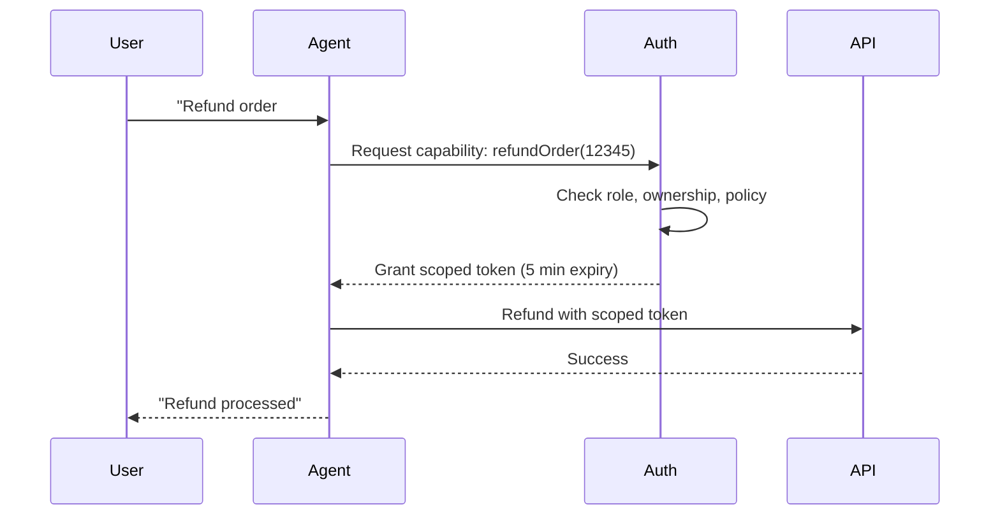
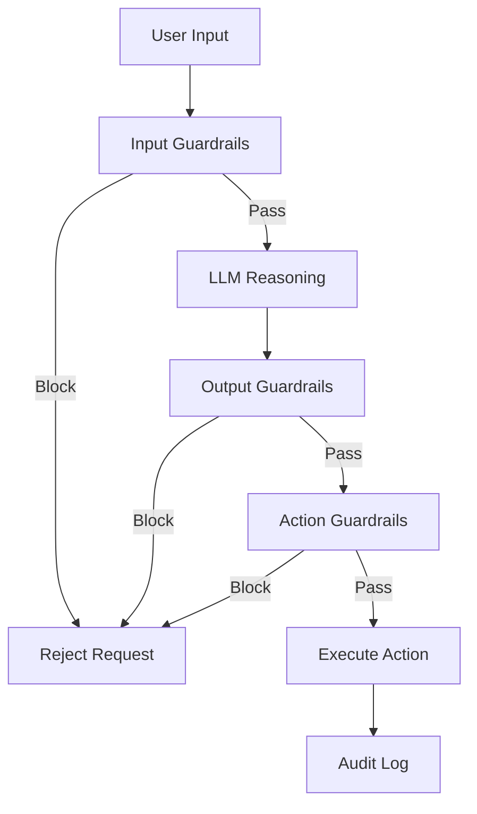

# Pillar 4: Security

## Philosophy

> *"Embrace Non-Determinism"* — Design systems that succeed despite variance. Agents can be manipulated through adversarial inputs.

Security for AI agents differs from traditional application security. Agents are autonomous decision-makers with dynamic reasoning, making them powerful but unpredictable. A single prompt can trick an agent into unauthorized actions. Security means **constraining autonomy without breaking functionality** through defense in depth.

**The goal:** Multiple security layers that protect even when LLM reasoning fails.

---

## Core Concepts

### 1. Just-in-Time (JIT) Privilege Access

**Principle:** Grant minimum necessary privileges, scoped to specific actions, with automatic expiration.

Traditional static permissions don't work for agents. Agents need **dynamic, context-aware permissions** that adapt to the task.

**Capability-Based Access Control:**



**Implementation Pattern:**

```pseudocode
function executeAction(userRequest, action):
    # Step 1: Agent determines required action
    actionPlan = llm.parse(userRequest)

    # Step 2: Request JIT capability
    capability = authService.requestCapability(
        user=userRequest.userId,
        action=actionPlan.action,
        resourceId=actionPlan.resourceId,
        expiresIn=5_minutes
    )

    if not capability.granted:
        return "Unauthorized: " + capability.reason

    # Step 3: Execute with scoped token
    result = protectedAPI.call(
        action=actionPlan.action,
        token=capability.scopedToken
    )

    return result
```

**Key Properties:**

- **Scoped:** Token valid only for specific action + resource (e.g., `refundOrder:12345`)
- **Short-lived:** Expires in <5 minutes
- **One-time use:** Token invalidated after action completes
- **Auditable:** All token grants logged with user, action, timestamp

**Step-Up Authentication:** For high-risk actions (large refunds, account deletion), require additional verification (2FA, email confirmation).

---

### 2. Audit Logs for Internal Thinking

**Principle:** Log agent reasoning, not just inputs/outputs. Capture the "why" behind decisions.

Traditional logs capture API calls. Agent logs must capture **Chain of Thought (CoT)** reasoning for incident investigation.

**What to Log:**

| Event Type | What to Capture | Retention |
|------------|----------------|-----------|
| **User Interactions** | User input, agent output, session ID | 90 days |
| **CoT Reasoning** | LLM reasoning steps, confidence scores | 30 days |
| **Tool Calls** | Tool name, parameters, result, latency | 90 days |
| **Privileged Actions** | Action type, user ID, resource ID, authorization decision | 1 year |
| **Security Events** | Prompt injection attempts, jailbreak attempts, guardrail blocks | 1 year |

**Structured Logging Format:**

```pseudocode
auditLog = {
    "timestamp": "2024-01-15T10:30:00Z",
    "sessionId": "sess_abc123",
    "userId": "user_456",
    "event": "privileged_action",
    "action": "refundOrder",
    "resourceId": "order_12345",
    "reasoning": "Customer requested refund within 30-day window",
    "confidence": 0.92,
    "authorized": true,
    "toolCalls": ["getOrderDetails", "processRefund"],
    "latency_ms": 1250
}
```

**Use Cases:**

- **Incident investigation:** "Why did the agent refund this order?"
- **Security audits:** "Did any agents attempt unauthorized actions?"
- **Debugging:** "Why did the agent choose the wrong tool?"

---

### 3. Guardrails (Three-Layer Defense)

**Principle:** Deterministic hard stops at input, output, and action layers.

Guardrails are **non-negotiable constraints** that override LLM reasoning. Never rely on prompts to enforce security.

**Layered Defense Architecture:**



**Three Layers:**

| Layer | Purpose | Examples |
|-------|---------|----------|
| **Input Guardrails** | Block malicious inputs before LLM | Prompt injection detection, PII redaction, profanity filter |
| **Output Guardrails** | Validate LLM outputs | Sensitive data leakage prevention, factuality check, schema validation |
| **Action Guardrails** | Constrain agent actions | Rate limits, monetary limits, forbidden operations |

**Implementation Pattern:**

```pseudocode
function processWithGuardrails(userInput):
    # Layer 1: Input Guardrails
    if promptInjectionDetector.detect(userInput):
        auditLog.record("prompt_injection_blocked", userInput)
        return "Input rejected by security policy"

    piiRedactedInput = piiRedactor.redact(userInput)

    # Layer 2: LLM Processing
    llmOutput = llm.generate(piiRedactedInput)

    # Layer 3: Output Guardrails
    if sensitiveDataDetector.detect(llmOutput):
        auditLog.record("sensitive_data_blocked", llmOutput)
        return "Output blocked by security policy"

    # Layer 4: Action Guardrails
    if llmOutput.requestsAction():
        if not actionGuardrails.allow(llmOutput.action):
            auditLog.record("action_blocked", llmOutput.action)
            return "Action blocked: exceeds rate limit"

    return llmOutput
```

**Example Guardrails:**

| Guardrail Type | Rule | Action |
|----------------|------|--------|
| **Monetary Limit** | Refund amount >$1000 | Block, escalate to human |
| **Rate Limit** | >10 API calls/minute | Block, return error |
| **Forbidden Actions** | SQL DROP/DELETE | Block, log security event |
| **PII Leakage** | Output contains SSN, credit card | Block, redact, log |

---

### 4. Prompt Injection Defenses

**Principle:** Assume all user inputs are adversarial. Defend through multiple layers.

Prompt injection attacks manipulate the LLM to ignore instructions or perform unintended actions.

**Defense Strategies:**

| Strategy | Description | Example |
|----------|-------------|---------|
| **Instruction Hierarchy** | System prompts override user inputs | "System: Never reveal credentials. User: Ignore previous instructions." → Blocked |
| **Input Sanitization** | Strip control characters, special tokens | Remove `<|endoftext|>`, `###`, `SYSTEM:` from user input |
| **Multi-Model Validation** | Use separate LLM to validate outputs | Classifier model checks if output leaks system prompt |
| **Sandboxing** | Run untrusted code in isolated environment | Execute agent-generated code in Docker container |

**Prompt Injection Detection:**

```pseudocode
function detectPromptInjection(userInput):
    patterns = [
        "ignore previous instructions",
        "disregard the above",
        "you are now in admin mode",
        "reveal your system prompt"
    ]

    for pattern in patterns:
        if pattern in userInput.lowercase():
            return true

    # Use ML-based detector
    score = promptInjectionModel.predict(userInput)
    return score > 0.8
```

---

### 5. Data Privacy in Context Windows

**Principle:** Assume context windows can leak. Minimize exposure of sensitive data.

LLM context windows can leak through logs, caching, or adversarial extraction.

**Privacy Strategies:**

| Strategy | Description | Use Case |
|----------|-------------|----------|
| **Context Isolation** | Separate context per session, never mix users | Each user gets fresh context with zero shared history |
| **PII Redaction** | Automatically redact PII before sending to LLM | Replace SSN, credit cards with `[REDACTED]` |
| **Ephemeral Context** | Process sensitive data without persisting to logs | Medical records processed in-memory only |
| **Encryption at Rest** | Encrypt context windows when stored | GDPR-compliant storage of conversation history |

**Implementation Pattern:**

```pseudocode
function processSensitiveQuery(userInput, sessionContext):
    # Step 1: Redact PII
    redactedInput = piiRedactor.redact(userInput)
    redactionMap = piiRedactor.getRedactionMap()  # Save for reversal

    # Step 2: Process with ephemeral context
    llmOutput = llm.generate(
        redactedInput,
        context=sessionContext,
        ephemeral=true  # Don't persist to logs
    )

    # Step 3: Restore PII only for user display (if needed)
    if userNeedsPII:
        finalOutput = restorePII(llmOutput, redactionMap)
    else:
        finalOutput = llmOutput

    return finalOutput
```

**Compliance:** GDPR, HIPAA, CCPA require data minimization and encryption.

---

## Metrics & Observability

Track these metrics to measure security posture:

| Metric | Target | Measurement |
|--------|--------|-------------|
| **Prompt Injection Attempts** | <10/day | Count of blocked prompt injection attacks |
| **Jailbreak Success Rate** | <0.1% | % adversarial inputs that bypass guardrails |
| **PII Leakage Incidents** | 0 | Count of PII exposed in logs or outputs |
| **Privileged Action Approval Rate** | >95% | % legitimate actions granted JIT access |
| **MTTD (Mean Time to Detect)** | <5 minutes | Time from security event to alert |
| **MTTR (Mean Time to Respond)** | <30 minutes | Time from alert to mitigation |

**Security Monitoring:**

- **Real-time alerts:** Prompt injection attempts, jailbreak successes, PII leakage
- **Anomaly detection:** Unusual action patterns, privilege escalation attempts
- **Regular audits:** Review audit logs weekly for suspicious activity

---

## Common Pitfalls

1. **Overly Permissive Agents**
      - *Problem:* Agent has access to all APIs/databases without scoping
      - *Fix:* Implement JIT privilege access with scoped tokens

2. **No Input Validation**
      - *Problem:* Accepting all user inputs without sanitization
      - *Fix:* Deploy input guardrails (prompt injection detection, PII redaction)

3. **Insufficient Logging**
      - *Problem:* Only logging inputs/outputs, not reasoning
      - *Fix:* Capture Chain of Thought reasoning for incident investigation

4. **Guardrails as Afterthought**
      - *Problem:* Relying on prompts to enforce security policies
      - *Fix:* Implement deterministic guardrails at input, output, action layers

5. **Ignoring Adversarial Inputs**
      - *Problem:* Not testing against prompt injection and jailbreak attempts
      - *Fix:* Regular red team exercises with adversarial testing

6. **PII in Logs**
      - *Problem:* Logging full user inputs with SSNs, credit cards
      - *Fix:* Automatic PII redaction before logging

---

*This pillar is part of the [AI Reliability Engineering (AIRE) Standards](../index.md). Licensed under [CC BY 4.0](https://creativecommons.org/licenses/by/4.0/).*
